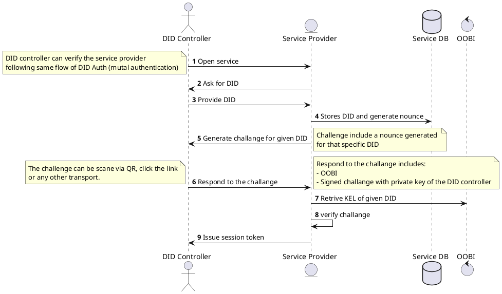

# KERI Community Meeting Agenda

Chair: Samuel M. Smith [email](sam@prosapien.com)
Co-Chair: Philip Feairheller [email](pfeairheller@gmail.com)

Meeting Bi-weekly starting on 2021-10-19 at 10 am EDT

Agenda:
https://github.com/WebOfTrust/keri/blob/main/agenda.md

Zoom Meeting:
https://us02web.zoom.us/j/89842900185?pwd=OEpXSU5pa29FR1A3OXFkUithZFNwQT09
Meeting ID: 898 4290 0185
Passcode: 300255

Calendar Invite:
https://us02web.zoom.us/meeting/tZ0lc-uhrjsrEtFmV2aSfAzR015DDL-ld-hg/ics?icsToken=98tyKuGhpj8oE9SVsRGCRpx5Go-ga_PziGJcj7d7kSm3AhNVQxnEZrMXFpZTXdTU

KERI Slack: keriworld.slack.com
https://join.slack.com/t/keriworld/shared_invite/zt-14326yxue-p7P~GEmAZ65luGSZvbgFAQ

Explanation of KERI development tools and techniques: [KERI development environment](https://github.com/WebOfTrust/keri/blob/main/docs/keri-dev-env.md)

## Meetings

### Future Topics

- How to  make any data authentic using KERI and friends -> Authentic Web
    - Authentic Web as a verifiable data structure built from signed hash chained content addressable data
    - Solves the hard problem of zero-trust architectures = signed-at-rest
        - key state at rest
        - signed data at rest wrt key state of peristent identifiers
        - signed in motion is relatively easy because can use ephemeral identifiers with ephemeral key state
    - Mental model of Verifiable Data Structures all the way down
        - Genealized hash chained signed data structures (provenanceable)
            - hashed list. 
            - hash of concatenated hashes in list
            - hash of cat blineded hashes in list
            - Hash Graph
                - Hash DAG
                - Custom Hash DAG
                - Merkle root hash (binary tree) Sparse Merkle Tree
                - Patricia Merkle (Trie) root hash 
            - Signed Hash Graph
                - Signed Hash DAG
                    - ACDC is a type of Custom signed Hash DAG iteself and distribute universal Hash DAG fragment
            - Cryptographic Accumulators
                - Collective Signatures (BBS+)
                - CL Signatures (AnonCreds)
        - Hash Log
            - KEL is a hash log for key state
            - TEL is a hash log for every other kind of state anchored to key state
                - TEL as versioned hash log
        - Content Addressable (Hash indexed) Database
            - De-duplication
            - universaly unique identifers as indexes = secure distributable database 
            - SAID as index = crypto agile interoperable universally unique identifiers as indexes
                - ACDC is a type of content addressable SAID database fragment, graph fragment
            - B-Tree branch 
    - Append to Extend
        - permissionless data type registry
        - permissionless rules registry
        - ecosystem governance through permissionless but trusted (reputable) (web-of-trust)  registries
    - Versioned Authentic data
        - TEL transfer registry for versioned authentic data
        - TEL transfer registry for NFTs
        - TEL/ACDC for authentic messaging registry
        - TEL/ACDC for authentic versioned document registry
    - BADA/RUN when not use KEL Seals for distributed authentic database
        - replay attack protection through monotonicity
            - replay signed date-time stamped message 
            - replay stale keys to newly date-time stamp and sign message
            - 
- Eclipse Attack Comparison KERI vs PoW
- More discussions for Witnesses and Watchers.  Gossip protocol, UDP, ecosystem configuration.
- Custodial Agents
- Demo of how to write tests for KeriPy

### ToDo
- Future extract Keep library to NPM library
- Cardarno as Ledger Registrar
- github actions for releases
    - including docker containers
- Creating webdriver (or selenium) tests for generic features of Keep.
- Docker Container with port for ReST API
- Split out keripy core from keripy Rest API

### Discussion items

### 2022-10-04
- Recording
    - TBD

- Reports
    - CESRox
        - Define an approach to building library
        - Create a beginning of a Roadmap
        - Sam:  Count code table contains many exploratory codes that can be ignored, recent changes to indexed signature changes
        
    - KERIpy
        - Sam:  added support for dual indexed signatures in CESR and keripy.  Final step for reserve participants and custodial participants in partial rotation.  Prior next key list and current signing list are no longer the same.  Allows for flexibility needed for new rotation logic.
        - New codes which indicate what type (single, same, different, missing) of indices exist for a give signature.
        - Support for privacy preserving credentials in kli and agent
        - Compact credential support being added this week
    - vLEI
        - Sally reporting server - https://github.com/GLEIF-IT/sally
        - example of verification service / ACDC watcher
    - Keep
        - Rebranding for vLEI
    - KERIox
    - CESR
        - Dual indexed signature codes

- Items
    - Signify  (Signing at the Edge with keys at the edge)
        - Backgroud
            - Only a small set of activities that need to be protected in infrastructure for key management
                - key pair creation
                - key pair storage
                - event generating 
                - event signing
                - event verification
            - Trade off where these actions happen based on where you can secure / protect things.
            - Secure code supply chain for key pair creation and event signing.  Then storage is secured by encrypting where the keys are store
            - Signing is another level of security because you have to USE the private keys
            - What are the liabilities do a cloud host have to worry about.
                - Cloud host does not want to see keys (non-repudiation).  So we want to move event signing out of the cloud agent
                - Key state (next digest and current signing key) come from the client.
                - Cloud host ensures that the code supply chain is secure and never sees the private keys
            - Think of credential signing as yet another event generation and signing
            - We want to minimize what we program in the client.  Simplify the client to only the things we don't want in the cloud
                - key pair creation
                - event signing (the problem we want to avoid)
            - Key storage is stored encrypted on the client and can be backed up encrypted on the cloud so the cloud never sees the keys
            - Escrow - used it protocol design to handle out of order events.  Store the event and wait for the other stuff to show up and then continue processing of the event
            - Firebase approach of using SSE events to ping the client that a dataset has changed and needs attention.  Same approach used here to notify client that something needs to be signed or key pairs need to be created.  Those would be datasets that a client can check at anytime (start up, after loss of connection, after SSE event shows up).
            - Wallet - loaded term.  
            - Signify has nothing to attack at rest.  Encrypted secrets stored in the cloud.  A stateless wallet.
            - How does Signify trust that what she is signing is the correct thing.
                - Have to trust that the cloud provider has secured the agent code is running correctly
                - Cloud host could sign everything it sends to Signify

        -Signify is a web client event signing and key pair creation app that minimizes the use of KERI on the client. The web host cloud agent never sees any of the client's private keys in the clear, these are only unlocked in memory on the client only using the client's passcode which can be used to derive an asymmetric encryption/decryption key pair. The client creates key pairs and then sends them encrypted to the cloud agent that stores them encrypted. Whenever the client needs something signed, the cloud agent does the event generation in response to the client's commands and then sends the generated event back to the client along with the necessary encrypted private signing keys.  The client can then decrypt the private keys to sign and send back the signatures on the event. The client can then delete those private keys from memory. So Signify is key creation and event signing in the edge with key storage, event generation, and event verification in the cloud.  
Because event verification happens in the cloud it can use full KERI ACDCs etc and all signify clients can use full-featured web agents. The edge devices running the client only need to be able to create key pairs and sign events so they don't need to actually implement any KERI Core-specific functionality.  Although CESR would be nice to have. They don't do verification, they don't talk to witnesses or watchers, that is all done by the web-hosted cloud agent. This minimizes the liability of the cloud agent's web host provider because they never see private keys, and the client app is just a client app but with a back channel for decrypting and signing events generated on the agent and does key pair creation locally. It is not a wallet, The cloud agent is the cloud wallet but the private keys are only used in the edge.

We think this might be a good trade space for facilitating web clients that do not need to store anything and all the heavy lifting is done in the cloud.

Clearly, because event generation and verification are happening in the cloud an attacker who successfully attacks the cloud code supply chain can cause mischief by tricking the client into signing events that the client doesn't really want to sign. But that mischief never rises to the level of key compromise.

- Implementation
    - Leverage existing KERI Agent but add a Signify API
    - Change Manager of KeyStore to have a remote signing mode. Whenit gets signing requenst from cloud agent sends the request on back channel to Signify client to sign.
    - Make the controller signing look like witness signing
    - Escrow eventings waiting for them to collect enought signatures or receipts to meeting a threshold of acceptance.
    - Store and Forward cloud agent. Client does not have to keep state from session to session. All state is kept in the cloud. Use SSE (server sent events) to notify client that state has changed.
    - Stateless Wallet

### 2022-09-20

- Recording
    - TBD

- Reports
    - CESRox
    - KERIpy
        - NEO Branch merged into development.  New support for stable value CESR codes.  Useful for non-crypto primitives.
        - Sam: working on changes to allow new rotation logic.  
            - Reserve signers and custodial signers.  Support indices that are not the same for the current and former signer list
            - Add support for dual indices to the idex code count table and Indexer class
        - Kevin: Adding support for privacy preserving attributes (nonce field) as well as compact credentials
        - Phil: Minor fixes and improvements for Agent interaction with the GLEIF Root of Trust roll out.
        - Arshdeep's pull request for KLI Apis
    - vLEI
        - Kevin:  Updating the vLEI schema for compact credential support and consistency across all schema
    - Keep
        - Support for all the GLEIF uses of the KEEP Root External and Internal
    - KERIox
    - CESR
        - Modified code table for index signatures
        - Updated CESR spec, include changes for stable values in all codes
    - Provenant
        - Working on becoming a QVI, technical and people dimensions.
        - Standing up witnesses
        - Will need and become involve in CESRox

- Items
    - Question regarding adding new code support to CESR.  
        - Collective signatures that have variable length
        - https://github.com/WebOfTrustInfo/rwot11-the-hague/blob/master/advance-readings/CESR-adapter-for-sophisticated-multisig.md
        - Will be able to use the new variable length codes to support these new signature types
    - RootsID - Encountering KERI in the wild in conversations with clients, etc.
    - Article:  https://www.ksoeteman.nl/2022/08/self-sovereign-identity-can-do-just-fine-blockchain-less/
    - W3C TPAC Meeting.  Sam attended as an invited expert to give talk on ACDC.  Outcome unclear.  
        - Discussion about adding JSON Schema support
        - Discussion about registries.  Append-to-extend is ACDC solution to no registries.
        - https://github.com/w3c/vc-data-model/issues/934  JSON Schema
    - Time to start talking about IIW presentations and collaborations.
        - GLEIF - announcing the completed vLEI root of trust.  
        - KERI and DIDComm for DIDComm v3
        - ToIP Technical Architecture v2
    - Design principles being discussed at the KERI concepts meeting (edu) on Thursday
    - Discussion topic:  Root of trust and key management.
        - Sam paper:  Universal Identifier Theory.
            - https://github.com/SmithSamuelM/Papers/blob/master/whitepapers/IdentifierTheory_web.pdf
            - 3 Types we care about.
                - 1. Cryptonomous Identifier.  Self certifying.  Derived from pub/priv key pairs
                    - [Transferable](https://github.com/trustoverip/acdc/wiki/transferable-identifier) vs [Non-transferable](https://github.com/trustoverip/acdc/wiki/non-transferable-identifier) identifiers ([persistent](https://github.com/trustoverip/acdc/wiki/persistent-identifier) vs ephemeral)
                - 2. Public Identfiers that are not cryptonomous.  DNS domain, social security number, etc.  (Non-cryptographically generated ID)
                - 3. Local Identifiers, Aliases.  Only have meaning to a local entity.  Not shared, avoids collisions.  
                    - Pet Names: Take local identifiers and share them with "friends".  Trying to solve Zooko's Triangle.
                        - https://en.wikipedia.org/wiki/Zooko%27s_triangle
                        - Can be solved with an identifier graph.  
                    - Problem with collisions.  
            - To solve the problems with #2 you have a trust domain.  You place each identifier in a trust domain resolved by the cryptonomous identifiers associated in the trust domain.  This avoids the need for a centralized registry or locus of control.  Because we solved the collision problem of namespacing.
            - Multi-factor association of loci of control.  For example, GLEIF will publish the root of trust to multiple public sources.  The set of these publication has loci of control which allows us to bootstrap the root of trust.
    - Classification of identifiers.  "Important identifiers" that hold credentials vs ephemeral identifiers used for short term communications.
        - If you can afford to discard the identifier, use non-transferable identifiers, for example witnesses.
        - If your identifier is going to have reputation that can't be discarded use transferable identifiers.

### 2022-09-06

- Recording
    - TDB
- Reports
    - CESRox
        - Meeting on Thursday.  Decided on some first steps.
        - Porting some code from KERIox to CESRox in the next few weeks
    - KERIpy
        - `neo` branch updates to CESR.  New serialization mechanism.  Stable codes
            - Should merge into development this week
            - Will break any scripts or configs that rely on stable AIDs generated from salts
    - Keep
        - Usability updates from lessons learned from Pilot
        - GLEIF Root-of-Trust Build for production ready
        - Bug Fixes
        - Ubisecure
            - trying to use keep multi-sig inception of root delegation
        
    - KERIox
        - Continue work on delegation
    - CESR
        - Updated spec with new serialization conversions. Bin <-> Raw <-> Text.
        - CESR native versions of KERI event messages specification on the way
        - CESR native version of thresholds.
        - Modifications to the group codes.
        - Improvements aimed at helping CESR move beyond KERI and cryptographic primitives
    - Provenant
        - Working towards become a vLEI QVI.  
        - Working on stable deployment of witness network(s).
            - Relative to Stable Net / Builder Net in blockchain world like Sovrin
            - Moving into a "production mode" in infrastructure.
        - Recognition that this is will be a common problem for community
- Items
    -  Future of the Witness Network and Watcher Network
        -  What will it look like in the future?  
            -  Witnesses for "high stakes" identifiers will run on proprietary infrastructure
            -  Witness as a Service (WiaS).  Witness hosting that can be provisioned on demand
        -  What will the Watcher Network look like in the future?
            -  Community collaboration.
            -  Watcher as a Service (Waas?).
        -  Are these networks interconnected?
            -  There will be gossip protocol between Watchers.  Universally watches key state and detects duplicity and shares via gossip across the network.  Similar to the ceritficate transparency protocol used for SSL certs.  Will KERI it is either duplicity or not.  No guess work.
        -  Is it safe to assume that the Watcher network exists?
            -  Sam:  A verifier is a watcher.  Right now in the core, watchers are dumb.  If there is duplicity, it is simply discarded.  In the future, watchers will report on that duplicity and share both KERLs and duplicity across other Watchers.  
        -  Global vs Contextual Watcher networks?
            -  Varying layers of watcher networks...  Major companies, ecosystem and global watcher networks all sharing with each other.  
            -  The only attack on KERI is an eclipse attack so the larger your watcher network reach is the better your protection from this type of attack.  The only limitation is a resource constraint.  
            -  Where do the Judges run?  AT&T vs T-Mobile.  The only "fault" that is apparent is an attach on the KEL.  And that can only occur via key compromise.  So a successful multi-threshold attach causing duplicity is the only thing Watchers are looking for.  So even competitors will want to share across the entire ecosystem.  Similar to certificate transparency, all competitors in the internet hosting space share the information with each other because it is in their best interest to eliminate fraud / duplicity.
            -  Up to the ecosystems to cooporate on Watcher networks, controlled by the validators.
        -  Key compromise is very difficult, especially with multi-sig.  So there should be very few dupicitous occurances(sp?) across the KERI ecosystem.
        -  Pub-Sub push interface for current witness code plus running a witness in promiscuous(sp?) mode to make a watcher.
            -  Down the road, UDP gossip interface for witnesses and watchers sharing KELs
    -  Relationship between DIDComm and KERI/ACDC (Daniel Hardman)
        -  DIDComm and KERI have complimentary emphasis.
        -  Significant Overlaps across DIDComm and KERI
        -  Presentation from Daniel (proposal for how to "combine" the communities):
            -  https://bit.ly/3BeC9Wf
        -  Call for members of the KERI community to join DIDComm conversation and +1 calls for using CESR encoding in DIDComm
        -  DIDComm v2 just ratified in DIF and the conversation for v3 is now open.
            -  This is the time to start working towards unification.
            
    -  More CESR

- Terms relevant in the (roll-out of) KERI watcher network:
1. https://github.com/trustoverip/acdc/wiki/eclipse-attack
2. https://github.com/trustoverip/acdc/wiki/promiscuous-mode
3. https://github.com/trustoverip/acdc/wiki/protocol

### 2022-08-23

- Recording
    - https://drive.google.com/file/d/1X6z6MtplLP-fEqyBHbShgpG2JNwzfx5l/view?usp=sharing
    - 
- Reports
    - cesrox
        - Questions
                - Hackmd of what can be done: https://hackmd.io/W2Z39cuSSTmD2TovVLvAPg
            - What should the scope of CESROX be?
            - Where is the interface?
            - Does it parse and process events or does it just parse?
            - Should it be [SAX](https://dev.w3.org/XInclude-Test-Suite/libxml2-2.4.24/libxml2-2.4.24/doc/interface.html) like
            - keriox slack channel
    - keripy
        - Change encoding to stable readable value element in primitives
        - New count codes for better organization for collections and pipelining.
        - Blind OOBI support added, all witnesses now expose a blind OOBI (https://weboftrust.github.io/ietf-oobi/draft-ssmith-oobi.html#section-6 )
        - Agent updates to notifications and SSE messages
    - keep
        - separate ward from Keep UX
        - packaging how to build and distribute for MacOX
            - Cloud Agent Keripy without Keep but CLI or ReST API packaged build desktop
        - rebranding GLEIF future
    - KeriOx
        - Delegation work
        - Exn messages

- Items
    - Change to CESR encoding
    - ToIP Tech stack
        - Autonomous Identifier
            - "system"

### 2022-08-09

- Recording
    https://drive.google.com/file/d/1UFlIhg0Dg7YZWaCaoqIF1Q_XDEJAlp90/view?usp=sharing

- Reports
    - keripy
        - Tholder now supports CESR signing/next thresholds
            - CESR weighted threshold is variable length code (same as CESR proof path)
        - Witness endpoint dissemination by controller
            - Eliminates the need to configure witness pools with knowledge of each other
    - caxe 
    - keep
        - Proposed split into two repositories
            - Agent and UX/UI
    - keriml (CESR in Swift)
    - cesrox (https://github.com/WebOfTrust/cesrox)
        - (would obviate the need for CESR in Swift)
        - Provenant interested in contributing after Mid September
        - CESR NOM library to parse
        - serdes in Rust
        - 
    - keriox
        

- Agenda
    - Announcements:
        - Video Steven and Phil (IIW revisit session) : the kli interview and how it hopefully has become an integrated eduction resource : [here](https://hackmd.io/pv11Cne-TiG4zhXUS-T6IA). Straight to the subtitled vid on Youtube: [here](https://www.youtube.com/watch?v=GqjsRuu0V5A&list=PLXVbQu7JH_LHVhs0rZ9Bb8ocyKlPljkaG) 
        - Keri Concepts and Terminology
            - Every other Thursdays:  [Zoomlink](https://us02web.zoom.us/j/89893527631?pwd=S1VheVF4d2xpTTRTdERYbFFGUFdPUT09). Next Aug 9.

    
    - Upcoming (Heads Up) Proposed Changes to CESR
        - Support for CESR Native KERI Key Event Message Body
            - New codes
        - Change to encoding of fixed size primitives for enhanced readability of value portion
            - useful for numeric values like numeric thresholds, and sequence numbers
            - useful for non-keri useof CESR
                - proposed solution to CBOR vs JSON debate in IETF standards bodies
                - 
    - Quick questions:
        - What is an 'inquisitor'
        - Where can I find the (explanation of) dip, icp, di tags 
            - Answer: in the `development` branch of keripy in file 'src/keri/app/habbing.py'
        - What do we exactly mean with 'escrow state'
        - 
    -  OpenWallet Foundation
        -  Hyperledger Linux Foundation (consortium of supporters Ping, MS etc)
        -  in Opposition to proprietary Apple and Google Wallets, Open source standard wallet specification
        -  Different types of wallets but the concept of OpenWallet is one type
        -  EU also Digital Identity Wallet related
        -  Concerned about undesirable feature selection
            -  Jim St Clair is an organizer 
    - RWoT Hague
        - Henk Participating

### 2022-07-26

- Recording
    - https://drive.google.com/file/d/1daSaLeQwU6gwgMsZLQXbWUQtwcDQJqS-/view?usp=sharing

- Reports
    - keripy
        - No new developments. Cleanup from pilot
    - caxe 
    - keep
        - PR arshdeep
    - keriml
    - cesrox
    - keriox
        - Progress for async multi-sig
        - delegation

- Agenda
    - Announcements:
        - IETF BoF 114
            - SAT (Secure Asset Transfer)
            - https://datatracker.ietf.org/meeting/agenda
            - https://www.ietf.org/how/meetings/114/
            - 
    - plan for a bi-weekly meeting (KERI-ACDC for noobs) that does two things: work on documentation / terms / Q&A and at the same time education / AMA sessions.
        - Suggest time slot in the KERI Slack  Suggestion: Thursday 10 AM ET  
        - 
    - XBRL signing questions:
        - How generate facts file
    - Cover the proposed new rotation mechanism
        - 

### 2022-07-12

- Recording
    - https://drive.google.com/file/d/1mXTfwyZsgUHQAjXoheOkeu5ZMwt383hx/view?usp=sharing
- Reports
    - keripy
        - Finished up pilot
        - Rename master to name and development (shorten to dev)
            - main stable release
            - dev unstable but unit tests
            - Rest Scripts and CLI script updates (push to main)
            - will publish new docker container
        - pilot
    - caxe 
    - keep
        - vLEI ecosystem fixes enhancements
        - goal to extract vLEI stuff out
    - keriml
        - mijo is available work on CESR
    - cesrox
    - keriox
        - HCF
            - Exposed DART, 
            - Time escrow expiration of events
                - Async multi-sig
        - 
    

- Agenda
    - Announcements:
        - [RWOT sept2022 Europe - The Hague](https://github.com/WebOfTrustInfo/rwot11-the-hague/blob/master/advance-readings/rwot-primer.md) 
        - [proposal CESR adapter](https://hackmd.io/GbQO3p6QTge-8eQMGuMaeQ#CESR-adapter-for-sophisticated-multisigmd)
        
    - Partial queiries of KEL. Since sequence number query supported in KERIPY

    - Cleanup Items and Questions
        - Agenda items Henk:
          1. What is "Merging Habery PR"? Hab comes from 'Habitat'. It's a place where multi-sigs and AIDs are linked. _Habery_ manages a collection of Habs. A Hab is a datastructure (a Python object)
          The only hit (2022) in a Google search pointing to a github site 'habery _DOT_ github _DOT_ io' is NOT related.

            2. KERI / ACDC glossary alignment with ToIP concepts-terminology-wg [Example ACDC glossary](https://github.com/trustoverip/acdc/wiki) and eSSIF : [concepts terminologie](https://essif-lab.github.io/framework/docs/essifLab-glossary)

            3. Cleaning up KERI repos on WebOfTrust GitHub ?
                - Phil add to keri.readme to table of active repos
    
    - Ledger Registrar Backer vs KERI Tunnel
        - Discovery (KERI Tunnel)
            - Resolution Infrastructure
            - Service endpoints
            - Witnesses
        - Secondary Root-of-Trust
            - Replacing witnesswith with Ledger Registrar and Ledger Oracle
        - Hybrid secondary Root-of-Trust
            Not anchoring every event periodic anchor
            Snapshot Checkpoint KELs
          - Augmented Watcher Network
            - detect duplicity

    - New Tweaks in Pre-Rotation IETF-KERI Draft
        - 

### 2022-06-28

- Recording
    - https://drive.google.com/file/d/1XHmuB9vJOwa1AgJWUK6-_E0cfTbTlEoe/view?usp=sharing
    - 
- Reports
    - keripy
    - caxe 
        - 
    - keep
    - kiwi
    - keriml
    - keriox
        - HCF keriox
        - Dart client https://pub.dev/packages/keri
    - cesr4j
        - 
    - cesrox
        - 

- Agenda
    - Developments
        - Cardano Proposal for Registrar Backers
        - IETF BoF in July Week of 25th
            - SAT meeting on 26th 3-5 EST
            - SAT secure asset transfer working group
                - keri
            - https://www.ietf.org/mailman/listinfo/sat 
            - https://web3.mit.edu
            - https://datatracker.ietf.org/meeting/114/agenda
        - XBRL Report Signing Pilot GLEIF annual report
            - multiple signers
            - partial facts signers
            - multisig ACDCs authorizing signers
            - cloud agent Keep demo'd
        - 
        
    - Issues
        - Is NTRU algo worth looking at in context of "KERI meets embedded systems"?
            - https://csrc.nist.gov/CSRC/media/Events/Second-PQC-Standardization-Conference/documents/accepted-papers/grobschadl-lighteight-implmentation-NTRUE.pdf
            - Looks like NTRUSign is broken. 
            - NTRUEncrypt is usable. 
            - pqNTRUSign uses large signature sizes so is not immediately suitable for IOT
            - Too Much Crypto paper https://eprint.iacr.org/archive/2019/1492/1577734684.pdf
        - pull request from Henk
    https://github.com/WebOfTrust/keri/pull/19
        - Cardano Backer Registrar
            - metadata on cardano
            - 
        

### 2022-06-14
- Recording
  https://drive.google.com/file/d/16Lz1Amvlio4yfbkqtSVmgZGiomAy5miX/view?usp=sharing
  
- Reports
    - keripy
        - Mad dash pilot vLEI ecosystem
        - tests scripts for sample vLEI ecosystem
        - escrows fix for delegation approval IXN
        - fix for escrow of messages credential issuance
    - Keep
        - Major improvements
        - multiple builds
    - Keriml
        - Miho PR
        - CESR Swift should it be separate
            - 
    - CESROX
        - Anyone else interested in helping on CesrOX
        - Apache2
    - KeriOx
        - HCF  restructuring
            - Windows DLL and Unix
            - Dart

    - CAXE
        - XBRL with ACDC
        - Two commands 
            - extract XBRL facts from XBRL report
                - ACDC data attestation to facts
            - verification server
                - ixbrl veiwer Workiva  
                - Arelle Plugin (ARELLE = python xbrl framework  https://arelle.org/arelle/)
    - CESR4j
        - scaffold for Bazel replaces Maven Apache2
    
- Agenda
  - Proposal to goto git flow like policy for KERIpy
      - Two branches
          - main
              - stable code
              - regular or upon decision by community merge dev into main
              - releases PyPi off from main
              - unit tests 
              - github actions to do releases
              - docker containers
          - dev
              - active development
              - feature branches of dev
  - Trunk based versus Git Flow use case for git flow is community
      - 
  - How to engage in the community
    - Tests where API is stable
    - open issues to ask questions
    - learn by doing
        - unit tests
        - test an api and then contribute the test
        - once you fully understand how to use an API because to tested it then suggest an improvement via a pull request. 
    - take notes of your journey in an issue
    - Keep tests Opportunities
    - CLI framework Wrapper
        - 
    - ReST framework Wrapper
        - PostMan
        - Paw
        - Already Swagger OpenAPI
        - docker contrainer with ReST API port
    - Docker Containers
    
    - Test is best documentation
        - But documenting code with comments is always welcome
        - 

### 2022-05-31

- Recording
    - https://drive.google.com/file/d/15-ZiVKrpkjXHv6kLxkAV7K6x6BW-IseU/view?usp=sharing
    
- Reports
  - Keripy 
     - promiscuous percolated discovery through OOBIs using exn messages
     - lock command for secure key store to be fixed in new push move to keep
     - Ruth open issue
  
  - Keep
      - new lock/unlock
      - GLEIF vLEI ecosystem use case dominant
          - eventually pull out more generic capability
      - Support for one-way OOBI exchanges
      - Packaging
      - API additions for notifications
      - 

  - Keriml
  
  - KeriOX
      - KERIOX repo: https://github.com/THCLab/keriox
      - Nodejs and Dart clients: https://github.com/THCLab/keri-bindings/tree/master/bindings 
      - Docker imgs: https://hub.docker.com/r/humancolossus/keriox-witness and https://hub.docker.com/r/humancolossus/keriox-watcher
      - demo use case using all the infrastructure https://github.com/THCLab/dkms-demo

  - CAXE
      - https://github.com/WebOfTrust/caxe
      - XBRL with ACDC

- Agenda
    - Update on DIF: IP issue resolved
    - IETF-OOBI Draft  
        - https://github.com/WebOfTrust/ietf-oobi
    - We currently issue as a controller the `/end/role/add` OOBI and send it to  Watcher. AFAIK there's no any real usage of this OOBI (yet?) from the Watcher perspective. Shall it be understood as an introduction to Watcher AUTH mechanism? In essence this OOBI becomes an introduction OOBI from the contorller perspective to Watcher. Watchers don't accept any request, but only those that are AUTHenticated first. Thanks to that Watchers support only these controllers that "registered" themselves. (added by Michal)
    - Escrow Maintenance Rules
        - When adding key events to various types of escrow's, how to ensure given escrow will not be fulfilled with some random events? Currently any type of key event that has proper semantics and where `d` field equals to `digest(event)` may be escrowed and stay there forever (because for example the signature is missing or `sn` doesn't match ). Possible solutions:
        - escrows have some kind of retention policy 
        - events in escrow have exp time
        - escrows have limited capacity

### 2022-05-17

- Recording
    - https://drive.google.com/file/d/14WoVLlYILIaRw3BE4FnlpPONF8FR66AY/view?usp=sharing
    - 
- Reports
  - Keripy 
      - Python 3.10.4 support
      - Packaging
          
  - Keriml
  - Keep
      - Make files to build for each Role type of users in vLEI ecosystem
      - Github actions producing .dmgs .dep
      - UX/UI development
  - KeriOX
      - EUPL licence next week
      - NodeJS and Dart
      - Async MultiSync
  - Java

- Agenda
    - Kent Bull couldn't get the KeriPy demo running

    - KeriPY build issues
        - refresh virtual environment to be python3.10.4 and install dependencies
        - pull latest master and keep
    - RoadMap
        - Hierachical Recovery Nested Delegations
        - CESR versions of the KERI Messages
        - Watchers
    - Ledger Registrars
        - https://github.com/WebOfTrust/keripy/issues/90
        - Cardano Backer
        - 

### 2022-05-03

- Recording
https://drive.google.com/file/d/147yc11kAMB-yV58zdZFmdIQLs71PKf9r/view?usp=sharing
- Reports
  - Keripy 
  - Keriml
  - Keep
  - KeriOX
  - Java

- Items
    - Henk: IIW recordings available?
    - IIW Report
        - Phil Feariheller Side Conversations so valuable
        - Ledgers vs. KERI If you have a reason to use a ledger besides identifiers then you could use your ledger as a backer.
        - Witnesses and Watchers discussed
        - DID:ORB ledger agnostic KERI alternative?; it's Sidetree based. A sort of KERI light? KERI is more compact. Sam suggest using KERI as a bases for ORB.
        - The demo of Philip and Kevin was very well attended
        - KERI for Muggles https://docs.google.com/presentation/d/1mO1EZa9BcjAjWEzw7DWi124uMfyNyDeM3HuajsGNoTo/edit#slide=id.ga411be7e84_0_0
        - GLEIF presence was very good as a demonstration of the maturity of KERI.
        - KERI DID Tunnel  How to Build a Tunnel to KERI Island

        - VC Credential Formats 
        - Kevin GRiffith  first one in person
            - Demo of Keep Async Multisig.
            - Building of Reputation System using ACDC
            - Demo KERI Tunnel
            - Phil Session on KERI On Thursday
        - Janet Gonzalez
            - Keep UX session
            - Wow!  Use Cases for KERI
            - Timothy Ruff on Adoption "First usable credential anyone will have is a organization role creditial"
            - KYC is more than just SSI
        - Kent Bull
            - Fun to see the level of interest in KERI and SSI
            - TRaining courses 
            - Still early in the industry making a decision vs waiting for standard. Premature optimization.
            - CESR session
            - 
        - Randy Warshaw   GLEIF making an early decision and going for it.  GLEIF sessions use sessions
            - Stephan Wolff  no technical all use cases
            - Huge movement of people connection into KERI
            - UI Walkthorugh
            - ACDC sessions
            - Great to meet people been zooming with for so long
        - Alan Davies
            - Credential Master - Sales Force
            - First meeting
            - VCs for education ACDC introduction
            - Timothy's presentation: https://youtu.be/kLSLA8_VDFw               - 

        - DidComm KERI Tunnel

        - Syllabus for KERI
            - Clone KERI experts via training

        - Separate Zoom Chat converstion NOT!
        - 

### 2022-04-19

- Recording
https://drive.google.com/file/d/13vqXoG7QvGeAe96tj35YZaT_V7PSgs83/view?usp=sharing
- Reports 
    - Keripy Command LIne for Multisit API for viewing escrow state API for keystate. Keying repo swift interaction with keychain with local authentication python wrapper ctypes

    - Keriml Keep repackage Electron app to invoke python backend IIW demos on UX/UI

    - KeriOX development is happening on private repo EUPL private HCF

    - Java

- Items

    - OOBI initiated discovery for Witness.
        OOBI for SSE service endpoint published in .well-known of witness controller Domain Name
        Leveraging web search for discovery of OOBI
    HTML5 SSE replacement long polling comet push to clients polling OOBI for SSE service endpoint published in .well-known of witness controller Domain Name Leveraging web search for discovery of OOBI KeyStateNotice SSE endpoint that pushed latest keystate notice reuse sequence number from keystate for SSE sequence number oobi/ksn/ WebOfTrust/keripy#110

    - WebAuth uses of KERI SKWA

    - Signature Threshold vs. Multi-Sig (software threhold)

    - BLS signatures BBS+ signatures (collective signature)

### 2022-04-05

- Recording
    https://drive.google.com/file/d/13T8QZQ0MCdRCscI0wGkbKoB3XSsXMplj/view?usp=sharing
    - Recording Feb 22 also used for March 8, March 8 not available?
    - 
- Reports from Implementors
    - Keriox
        - OOBI problems
        - Tests for Partial Rotation
        - 
    - Keripy
        - Finshised Habery changes
            - Command Changes synchronized with ReST API
        - New APIs to support Keep (ReST)
            - Metadata for contacts in addition to AID 
                - Signed metadata BADA
            - UI support APIs for workflows
    - Keriml
        - No updates
    - Keep Kimi Kiwi
        - Screens
    - Documentation Efforts
        - MOOC

- Items
    - ACDC Spec Draft
        - https://github.com/trustoverip/tswg-acdc-specification
        - 
    - Educational resources (added by Henk)
        - Vid snippets & Subtitle automation 
        - Commit HackMD to Github every month
        - Suggest Authentication for Moodle (KERI) MOOC-trials (added by Henk)
           https://moodle.org/plugins/browse.php?list=category&id=21 
           Are we able to eat our own dog food?

    - Discuss gossip dissemination protocol:
        Disseminatin information:
            Actors need something to communicate
                Controller resposible to disseminate to Witnesses.
                    Witnesses gossip through gossip
                Watchers (Judges, Jurors)
            Percolation JIT NTK approach
                
      - types of discovery from Witness or Watcher (any host with KEL Database)
          - Known Specific Event Query  
          - Unknown but Latest Event Query
          - Waiting for anticipated event (such as delegation anchor, any multisig)
              - push subscribe to wait for anticipated event
              - HTTP SSE
              - UDP Gossip pub/sub
    - WebAuth
        - 

        
### 2022-03-22

- Recording
   https://drive.google.com/file/d/13IjKZpM_0WKVmhgIn0AHW16RxnwXvE5U/view?usp=sharing
   
- Reports from Implementors
    - keripy
        Habery Hab architecture to support multiple AIDs per set of resources
        Data OOBIs  Doobie.
        mime  schema+json  for JSON Schem
        vlei serves up json schema
        
    - keriml
        pronunced "Caramel"
        KIMI Keri Interactive Mobile Interface 
        
    - keriox
        - KEL changes new partial rotation field name alignment
        - Ready to do interoperablity tests.
        - Keriox on Android device
            - Flutter (Google cross platform) Dart

- Items
    - Interoperbility testing
        - Remote HCF into IIW interop demo
    - OOBI and Doobie
        - IETF spec for OOBI discovery (todo)
            - OOBI  Out of band Infrastructure: Internet is out-of-band infrastructure WRT KERI.
            - Leverge internet web discovery mechanisms 
            - KERI always verifies so security of internet is not a dependency.
            - OOBI infrastructure provides OOBI Introductions
        - How OOBIs work
            - Discover service endpoints that provide data in support of verifying an AID
            - ReST endpoints

### 2022-03-08

- Recording
    https://drive.google.com/file/d/11lsFNbUh6MOfGkuaWShEcWttRdeudIRn/view?usp=sharing
    
- Reports from Implementors:
    - keriox
        apache2.0 DIF EUPL
        OOBI implementation  - ACDC OCA OOBI
        Dart - Flutter for mobile

    - keripy
        Delegation and Multisig on Cmd Line with New Habery construct (multi-hab per shared resource set)
        Multi-sig delegation
        Partial Rotation support

    - keri-swift
        mit license forked to apache2 under web-of-trust for ordered serialization of maps
        inception event
        milo provenant 
        
    - keep
        Being built to be a generic tool from UX perspective
        Also task based workflows with workflow specific terminology

- Items
    - Interopathon before IIW in April for KeriOX and KeriPY interoperability
        - Keripy generates json versions of kel and vlei with schema to send to Keriox team
    - did:auth keri:auth
    - OOBI blog post
        - https://medium.com/@hvancann/510467856035
    - Partial rotation support
    
    

    

### 2022-02-22
- Recording
    https://drive.google.com/file/d/11lsFNbUh6MOfGkuaWShEcWttRdeudIRn/view?usp=sharing
    
- Reports from Implementors:
    - keriox
        - refactoring towards event driven architecture. Asynchronous event updates via escrows
        - OOBI
        
    - keripy
        - CLI now supports new Habery architecture.
        - SWagger UI operational for ReST API
        - Vacuuous bootstrap
        - Current work to update delegation.
        
    - keri-swift
        - Serder and Saidify for the Matter class and subclasses
        - Default Swift JSON encoder does not preserve property creation order.
        - Message Types #110 
        
    - IETF Standards
        - New publication of KERI IETF did:keri specification
        - New publication of KERI PTEL
        - IPEX  Issuance and Presentation exchange protocol ToDo
        - KERI ToDO
        - Hidden Attribute Credentials (ACDC)
            - XORA for one time use credentials
            - https://github.com/SmithSamuelM/Papers/blob/master/whitepapers/XORA.md

- Items
    - Documentation (Henk) -> sorry, not able to able to attend today, best regards, Henk

    - Walkthrough of OpenAPI and Sphinx documentation support
    - Fundamental security difference between PKI and non PKI trust bases
        - EU Wallet initiative

### 2022-02-08
- Recording
    https://drive.google.com/file/d/11TVWQAVIMqaWyY3NODJP-t7bXJ6D62Bx/view?usp=sharing
- Reports from Implementors:
    - keriox
        - No new features since last time.
        - Refactoring
    - keripy
        - Habery changes propogated through command line utils, and agent
            - Changed archtecture, split shared resources from AID specific code
            - Support for multiple AIDs per instance of KERIpy
    - keri-swift
        - pushed repo
        - Cross platform for iOS first eventually androic
        - LLVM compiler
    - IETF Standards
        - CESR Proof Sigantures posted
        - [ACDC spec moving IETF pipeline ToIP](https://github.com/trustoverip/tswg-acdc-specification)
        - PTEL spec published
        - IETF did:keri spec to be published
        - 

- New Getting Started with keripy
    - Encrypted keystore
    - SwaggerUI
    - OOBIs
    - 2-Factor Auth with Challenge/Response

- How do you see DEL's (duplicitous event logs)?
  - How they're created/maintained?
  - Basic building blocks/what kind of messages it contains?
      - Duplicity notice message
  - Basic logic for detecting duplicity
      - monotonic logic for first seen accepted event. Once seen, always seen, never unseen. No revision possible. Detection logic upon receipt of two versions of an event at the same sn for a given AID = duplicity. Live vs Dead duplicity. Dead means one version already accepted to other is duplicitous version. Live when two version but neither has yet been accepted because not fully witnessed. Hold in escrow until one or neither is accepted. If neither then hold in escrow until a subsequent rotation designates which of the two is the valid one and so one.
      - Monotonic logic protects against continuous revision eclipse attack vulnerability such as is the case for PoW ledgers.

- Henk: **Education** - first draft of the [KERI MOOC](https://hackmd.io/nuUu5S8UQjOHXw_a53LvvA) now backupped on [github](https://github.com/henkvancann/keri-1/blob/main/docs/KERI-Mooc.md) and logged-in users can edit the hackmd file.\
What do you think is a good way to develop KERI knowledge, provoke adoption and develop more programming capacity?

- A **rubric-based eval of did:keri** - Daniel Hardman: go to https://w3c.github.io/did-rubric/ and answer all the questions about did:keri.\
Decision made Feb 8: we wait until the IETF draft for DID:KERI is finalized. Henk could contribute in draft and then propose his edits to team first.     
    
  
- **Terms and understanding**
***'SAD' and 'SAID'***, for Europeans the difference in pronunciation of SAD and SAID is hard to grasp and reproduce.
    The terms are closely related so we are not very alarmed that people confuse the terms.

### 2022-01-25

- Recording:
     https://drive.google.com/file/d/1136sR2QXKF7tCIm3ieXLlfC1sDqyeOtT/view?usp=sharing

- Reports from Implementers:
    - KERIOX
        - Digest field SAID
        - escrow for witness receipts
    - KERIPY
        - Conversion to Habery (Habitat Factory) allows multiple Habs (Habitats) per shared resources
        - OpenAPI (Swagger) for ReST endpoints refactor to be more ReSTful
        - Sphinx based documentation for KERIpy on ReadTheDocs and CodeCoverage unit tests 
        - Working on command line changes for Habery vaccuous mode
        - Passcode encrypted key store support in command line
        - KIWI-KEEP UX UI Workflows plugin Task support for custom workflows
        - Zipped Eletron Distribution with Mithril and Material.org UX bare
        - KEEP has style guide
        - Could be adapted to Rust Backend

- Witness dissemination protocol (how Witnesses promulgate receipts to Validator network) // added by Michal
    - Validator requests key state from its Watchers 
    - Watchers request key state from other trusted watchers
    - Watchers then request key state from published witnesses (after OOBI bootstrap)
    - Witnesses may support push interface such as SSE so that Watchers can subscribe to witness updates of keystate
    - CRitical role of watcher is monotonic view of Key state. First Seen Policy. First seen always seen never unseen.
        - Enables duplicity detection
        - Enables redundancy high availability
        - Reconcilable duplicity
    - Juror and Judge Deciders
    - Juror difference between watcher is that Juror reports duplicity whereas watcher just drops
    - 

- OOBI
    - https://hackmd.io/MxTAIBQTRkWU4-w140tNuA
    - 

- Terms and understanding - Henk
    2. 'Backer' and 'Witness', are these a 100% synonym? And if so: why not use 'backer' and keep repeating now and again that it's about a synomym. If not: what's the exact difference?
- Roadmap:

### 2022-01-11
- Recording
    - https://drive.google.com/file/d/10HzfvmpVlru1CecRerF8KULg0vVImJFB/view?usp=sharing
    - 
- Roadmap
    - short term long term
    - CESR version of KERI events
        - UDP version of KERI (2nd Q)
        - Gossip Protocol for KERI Receipt, KeyState, and OOBI dissemination (2nd Q)
    - Recovery from delegated ID prerotated key compromise
    - Presentation and Issuance exchange protocols add Ricardaian Contracts in the `r` section
    - OOBI discovery and validation (Watchers)
    - Registrar Backer support
        - new config trait 
        - new seal type
    - Refreshing Doc strings 
        - Sphinx Support for doc strings
        - Swagger API
        - Test Coverage
    - Watcher Network
    - KERI and DID-Comm and IETF
    - KERI and peer did
    - SWift KERI Library for iOS and Android (LLVM)
    - 
- Reports from Implementers:
    - keripy
        - SADification and SAIDification of attachments
        - First implementation of CESR Proof Signatures, credential parsing moved to Parser
        - Habery with explict multi-Habitat support (multiple prefix IDs per database) - [related issue](https://github.com/WebOfTrust/keripy/issues/46)
        - Keep Repo Mithril and Material UX (https://github.com/WebOfTrust/keep)
    - keriox
        -  query mode done
        -  WIP: `d` in messages (issue 110)
            -  Goldilocks crypto agility, reduce complexity
            -  BowTie model for reasonsing about crypto committments
        -  WIP: working on escrows 
- IETF Internet Draft CESR-Proof
    - practical applications of CESR-Proofs
    - https://github.com/WebOfTrust/ietf-cesr-proof
- Discuss a URN namespace spec for KERI:
    -  it's a good idea to invent a URN specific for KERI. 
    -  Write a spec for it and register with IANA
        -  urn:NID:NSS/path?query#fragment
        -  Examples
            -  urn:aid:alblseejlske/path?query#fragment
            -  urn:keri:slgheilshe/path?query#fragment
- Henk: first draft of the [KERI MOOC](https://hackmd.io/nuUu5S8UQjOHXw_a53LvvA)

- OOBI
- SKWA (Simple KERI for Web Auth)
- Witness dissemination protocol (how Witnesses promulgate receipts to Validator network) // added by Michal

### 2021-12-14
- [recording](https://drive.google.com/file/d/1-jFXFGX0X_Bwgyq42xfT948dBxcZw_sJ/view?usp=sharing)
- Business
    - Meeting cancelled on Dec 28. Next meeting Jan 11th
- Reports from Implementers
    - keripy
        - CESR codes for variable length material.   core.coring.Matter object class now supports variable length codes.
        - encrypted content
        - legacy suites
        - pathing
    - keriox
        - Query messages development
        - Reply messages
        - KSN message
        - TSG 
- Discuss `did:keri` further usage (see Slack #general channel)
    - registrant. Need to update registered version to reference WoT repo not DIF repo
    - did:keri is a very loose wrapper around the KERI prefix, it's there for adoption
    - Maybe it's a good idea to invent a URN specific for KERI

- KERI incubation within IETF: work item under some WG / WG on its own...?
    - KERI presented to Blockchain WG; in the future perhaps hosted within this WG
    - We have to have a draft spec first. Then you form a (work item within a) working group to discuss the spec.
- Michal question: A lightweight protocol for streaming authentic data in  environments with unstable internet connection. Would CESR make sense?
    - Yes, we are able to create a UDP (asynchronous communication) version. It's easier to make UDP reliable than to make TCP scalable.
- GLEIF MultiSig demo KLI (command line version)
    - Two ways of reaching the threshold of a multisig by participant in a rotation event, is by sharing all public addresses among the group of possible signers. If you don't want to disclose pubic keys to other participants, then you could use digests of the public keys in a partial rotation event, where we only need the participating signers to reach the threshold; this subgroups needs to disclose their public keys.
- IETF CESR  variable length codes
    - Pathing for CESR Proofs Attachments SADs
- Partial Rotation 

### 2021-11-30
- Recording 
https://drive.google.com/drive/u/0/folders/1af1qa4cVw6vbuBGvqwa1sz9B2sk70ao-
- Query Msg Discussion
    - https://hackmd.io/Qsrfj7Y-TIGl5ESvrxWGxw
- New issues 
    - (https://github.com/WebOfTrust/keripy/issues/110#issuecomment-982631336)
- IETF CESR Draft   https://datatracker.ietf.org/doc/draft-ssmith-cesr/
- Distributed multi-sig protocol
    - KERI 

    - 

### 2021-11-16
[Recording](https://drive.google.com/drive/folders/1-4XrL8S9WHeSNzaZznSatYH8QkaOqsw4?usp=sharing)
- rpy message
    - d field for said
- exp message
    - d field for said
- qry message
    - d field for said
- All keri key event messages icp  rot dip drt ixn to add d field for said of message. ( https://github.com/WebOfTrust/keripy/issues/110 )
- p field will be said of prior message
- Query Message keriox (michal pietrus)
    - how handling query and reply
- New partial rotation
    https://github.com/WebOfTrust/keripy/issues/118
- Where we chat in realtime
- Issue update readme with status of features

### 2021-11-02

[Recording](https://drive.google.com/drive/folders/13dvg1X5djjezpYriDikxH25UNZ4meyvf?usp=sharing)
- Call-to-order
- Review Licensing Terms and Participation
- progress updates from
    - keripy team
        - ksn query get the current state existing key for identifier query for KEL to update
        - escrow query to get BADA (Best Available Data Logic)
    - HCF team
        - Leverage time stamping authority point in time that you trust
        - DIF update nothing new still trying to figure out what to do working group
        - Sam invite keriox and kerijs to attend this working group
- Witness network
    - clarification of receipts
        - count code #B indexed witness signatures is more compact than #C which is couplets
        - #B is useful if many witnesses
        - Witnesses as highly disposable entities with NonTrans AIDs
            - Listen on two ports TCP and HTTP
                - If TCP then assumes direct mode
                - IF HTTP then assumes indirect mode
            - Witness Hosts also provide a MailBox service with HTTP SSE (server sent events)
                - Controller of witnesses subscribes to SSE stream on Mailbox to read responses to its witness queries
                - Kubernetes pod
                - HTTP API is wrapper of keripy CESR message and unwraps to send to Parser: HTTP requests to Parsable CESR messages
    - delegation issues with witnesses  https://github.com/WebOfTrust/keripy/issues/100
    - 
- New change to ledger registrars as backers
    - https://github.com/WebOfTrust/keripy/issues/90
    - registrar backer allows some to use a ledger registrar backer and ledger oracle instead of a witness pool as the secondary root of trust. Registrar may also provide an oracle or may have multiple oracles not specified.
        - Witness KAACE algorithm provides a distributed consensus agreement.
        - TimeStamp of watchers is authoritative for validator  Judge role

### 2021-10-19

- Call-to-order
- Review Licensing Terms and Participation
    - Apache2, Inbound=Outbound, Developer Certicate of Origin, IETF Submission
- Discuss Progress on IETF draft submissions and IETF process
- keripy update
- Other agenda items
- How to not fork KERI
    - some would like to keep in DIF
    - Options
        - DIF not able to do KERI Spec without KERIpy group
        - Split KERI in pieces and have pieces in DIF
        - Political issues especially with respect to statements about IP.

