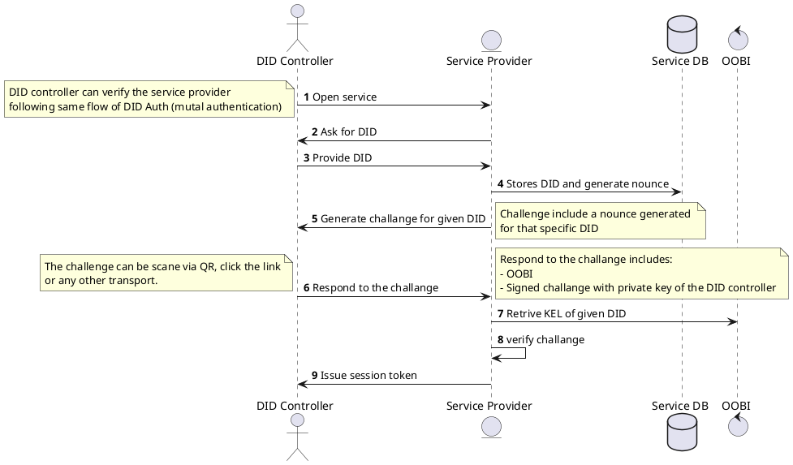

# KERI Community Meeting Agenda

Chair: Samuel M. Smith [email](sam@prosapien.com)
Co-Chair: Philip Feairheller [email](pfeairheller@gmail.com)

Meeting Bi-weekly starting on 2021-10-19 at 10 am EDT

Agenda:
https://github.com/WebOfTrust/keri/blob/main/agenda.md

Zoom Meeting:
https://us02web.zoom.us/j/89842900185?pwd=OEpXSU5pa29FR1A3OXFkUithZFNwQT09
Meeting ID: 898 4290 0185
Passcode: 300255

Calendar Invite:
https://us02web.zoom.us/meeting/tZ0lc-uhrjsrEtFmV2aSfAzR015DDL-ld-hg/ics?icsToken=98tyKuGhpj8oE9SVsRGCRpx5Go-ga_PziGJcj7d7kSm3AhNVQxnEZrMXFpZTXdTU

KERI Slack: keriworld.slack.com
https://join.slack.com/t/keriworld/shared_invite/zt-14326yxue-p7P~GEmAZ65luGSZvbgFAQ

## Meetings

### Future Topics
- Interopathon before IIW in April for KeriOX and KeriPY interoperability

- Future extract Keep liberary to NPM library
- WebAuth 
    - HCF Interactive Protocol
    - SKWA (Simple KERI for Web Auth)
        - https://hackmd.io/AXJ35eciSCa04FtG5Yg9Zg
        - keriAUTH / didAuth 
    - DIDAuth
        - https://github.com/WebOfTrustInfo/rwot6-santabarbara/blob/master/final-documents/did-auth.md

- Discuss https://github.com/WebOfTrust/keripy/issues/104 (added by Michal)
    - Auth and SKWA

### 2022-04-19

- Recording

- Reports
  Keripy 
     Command LIne for Multisit
     API for viewing escrow state
     API for keystate.
     Keying repo
        swift interaction with keychain with local authentication
        python wrapper ctypes
    
  Keriml
  Keep
    repackage  Electron app to invoke python backend
    IIW demos on UX/UI
  
  KeriOX
    development is happening on private repo EUPL private HCF
  
  Java
  
  

- Items
    - OOBI initiated discovery for Witness.
    -   HTML5 SSE replacement long polling comet push to clients polling 
        OOBI for SSE service endpoint published in .well-known of witness controller Domain Name
        Leveraging web search for discovery of OOBI
        KeyStateNotice  SSE endpoint that pushed latest keystate notice  reuse sequence number from keystate for SSE sequence number
            oobi/ksn/
        
    - WebAuth uses of KERI
    - Signature Threshold vs. Multi-Sig (software threhold)
      -  BLS signatures BBS+ signatures  (collective signature)

### 2022-04-05

- Recording

    - Recording Feb 22 also used for March 8, March 8 not available?
    - 
- Reports from Implementors
    - Keriox
        - OOBI problems
        - Tests for Partial Rotation
        - 
    - Keripy
        - Finshised Habery changes
            - Command Changes synchronized with ReST API
        - New APIs to support Keep (ReST)
            - Metadata for contacts in addition to AID 
                - Signed metadata BADA
            - UI support APIs for workflows
    - Keriml
        - No updates
    - Keep Kimi Kiwi
        - Screens
    - Documentation Efforts
        - MOOC

- Items
    - ACDC Spec Draft
        - https://github.com/trustoverip/tswg-acdc-specification
        - 
    - Educational resources (added by Henk)
        - Vid snippets & Subtitle automation 
        - Commit HackMD to Github every month
        - Suggest Authentication for Moodle (KERI) MOOC-trials (added by Henk)
           https://moodle.org/plugins/browse.php?list=category&id=21 
           Are we able to eat our own dog food?

    - Discuss gossip dissemination protocol:
        Disseminatin information:
            Actors need something to communicate
                Controller resposible to disseminate to Witnesses.
                    Witnesses gossip through gossip
                Watchers (Judges, Jurors)
            Percolation JIT NTK approach
                
      - types of discovery from Witness or Watcher (any host with KEL Database)
          - Known Specific Event Query  
          - Unknown but Latest Event Query
          - Waiting for anticipated event (such as delegation anchor, any multisig)
              - push subscribe to wait for anticipated event
              - HTTP SSE
              - UDP Gossip pub/sub
    - WebAuth
        - 

        
### 2022-03-22

- Recording
   https://drive.google.com/file/d/13IjKZpM_0WKVmhgIn0AHW16RxnwXvE5U/view?usp=sharing
   
- Reports from Implementors
    - keripy
        Habery Hab architecture to support multiple AIDs per set of resources
        Data OOBIs  Doobie.
        mime  schema+json  for JSON Schem
        vlei serves up json schema
        
    - keriml
        pronunced "Caramel"
        KIMI Keri Interactive Mobile Interface 
        
    - keriox
        - KEL changes new partial rotation field name alignment
        - Ready to do interoperablity tests.
        - Keriox on Android device
            - Flutter (Google cross platform) Dart

- Items
    - Interoperbility testing
        - Remote HCF into IIW interop demo
    - OOBI and Doobie
        - IETF spec for OOBI discovery (todo)
            - OOBI  Out of band Infrastructure: Internet is out-of-band infrastructure WRT KERI.
            - Leverge internet web discovery mechanisms 
            - KERI always verifies so security of internet is not a dependency.
            - OOBI infrastructure provides OOBI Introductions
        - How OOBIs work
            - Discover service endpoints that provide data in support of verifying an AID
            - ReST endpoints

### 2022-03-08

- Recording
    https://drive.google.com/file/d/11lsFNbUh6MOfGkuaWShEcWttRdeudIRn/view?usp=sharing
    
- Reports from Implementors:
    - keriox
        apache2.0 DIF EUPL
        OOBI implementation  - ACDC OCA OOBI
        Dart - Flutter for mobile

    - keripy
        Delegation and Multisig on Cmd Line with New Habery construct (multi-hab per shared resource set)
        Multi-sig delegation
        Partial Rotation support

    - keri-swift
        mit license forked to apache2 under web-of-trust for ordered serialization of maps
        inception event
        milo provenant 
        
    - keep
        Being built to be a generic tool from UX perspective
        Also task based workflows with workflow specific terminology

- Items
    - Interopathon before IIW in April for KeriOX and KeriPY interoperability
        - Keripy generates json versions of kel and vlei with schema to send to Keriox team
    - did:auth keri:auth
    - OOBI blog post
        - https://medium.com/@hvancann/510467856035
    - Partial rotation support
    
    

    

### 2022-02-22
- Recording
    https://drive.google.com/file/d/11lsFNbUh6MOfGkuaWShEcWttRdeudIRn/view?usp=sharing
    
- Reports from Implementors:
    - keriox
        - refactoring towards event driven architecture. Asynchronous event updates via escrows
        - OOBI
        
    - keripy
        - CLI now supports new Habery architecture.
        - SWagger UI operational for ReST API
        - Vacuuous bootstrap
        - Current work to update delegation.
        
    - keri-swift
        - Serder and Saidify for the Matter class and subclasses
        - Default Swift JSON encoder does not preserve property creation order.
        - Message Types #110 
        
    - IETF Standards
        - New publication of KERI IETF did:keri specification
        - New publication of KERI PTEL
        - IPEX  Issuance and Presentation exchange protocol ToDo
        - KERI ToDO
        - Hidden Attribute Credentials (ACDC)
            - XORA for one time use credentials
            - https://github.com/SmithSamuelM/Papers/blob/master/whitepapers/XORA.md

- Items
    - Documentation (Henk) -> sorry, not able to able to attend today, best regards, Henk

    - Walkthrough of OpenAPI and Sphinx documentation support
    - Fundamental security difference between PKI and non PKI trust bases
        - EU Wallet initiative

### 2022-02-08
- Recording
    https://drive.google.com/file/d/11TVWQAVIMqaWyY3NODJP-t7bXJ6D62Bx/view?usp=sharing
- Reports from Implementors:
    - keriox
        - No new features since last time.
        - Refactoring
    - keripy
        - Habery changes propogated through command line utils, and agent
            - Changed archtecture, split shared resources from AID specific code
            - Support for multiple AIDs per instance of KERIpy
    - keri-swift
        - pushed repo
        - Cross platform for iOS first eventually androic
        - LLVM compiler
    - IETF Standards
        - CESR Proof Sigantures posted
        - [ACDC spec moving IETF pipeline ToIP](https://github.com/trustoverip/tswg-acdc-specification)
        - PTEL spec published
        - IETF did:keri spec to be published
        - 

- New Getting Started with keripy
    - Encrypted keystore
    - SwaggerUI
    - OOBIs
    - 2-Factor Auth with Challenge/Response

- How do you see DEL's (duplicitous event logs)?
  - How they're created/maintained?
  - Basic building blocks/what kind of messages it contains?
      - Duplicity notice message
  - Basic logic for detecting duplicity
      - monotonic logic for first seen accepted event. Once seen, always seen, never unseen. No revision possible. Detection logic upon receipt of two versions of an event at the same sn for a given AID = duplicity. Live vs Dead duplicity. Dead means one version already accepted to other is duplicitous version. Live when two version but neither has yet been accepted because not fully witnessed. Hold in escrow until one or neither is accepted. If neither then hold in escrow until a subsequent rotation designates which of the two is the valid one and so one.
      - Monotonic logic protects against continuous revision eclipse attack vulnerability such as is the case for PoW ledgers.

- Henk: **Education** - first draft of the [KERI MOOC](https://hackmd.io/nuUu5S8UQjOHXw_a53LvvA) now backupped on [github](https://github.com/henkvancann/keri-1/blob/main/docs/KERI-Mooc.md) and logged-in users can edit the hackmd file.\
What do you think is a good way to develop KERI knowledge, provoke adoption and develop more programming capacity?

- A **rubric-based eval of did:keri** - Daniel Hardman: go to https://w3c.github.io/did-rubric/ and answer all the questions about did:keri.\
Decision made Feb 8: we wait until the IETF draft for DID:KERI is finalized. Henk could contribute in draft and then propose his edits to team first.     
    
  
- **Terms and understanding**
***'SAD' and 'SAID'***, for Europeans the difference in pronunciation of SAD and SAID is hard to grasp and reproduce.
    The terms are closely related so we are not very alarmed that people confuse the terms.

### 2022-01-25

- Recording:
     https://drive.google.com/file/d/1136sR2QXKF7tCIm3ieXLlfC1sDqyeOtT/view?usp=sharing

- Reports from Implementers:
    - KERIOX
        - Digest field SAID
        - escrow for witness receipts
    - KERIPY
        - Conversion to Habery (Habitat Factory) allows multiple Habs (Habitats) per shared resources
        - OpenAPI (Swagger) for ReST endpoints refactor to be more ReSTful
        - Sphinx based documentation for KERIpy on ReadTheDocs and CodeCoverage unit tests 
        - Working on command line changes for Habery vaccuous mode
        - Passcode encrypted key store support in command line
        - KIWI-KEEP UX UI Workflows plugin Task support for custom workflows
        - Zipped Eletron Distribution with Mithril and Material.org UX bare
        - KEEP has style guide
        - Could be adapted to Rust Backend

- Witness dissemination protocol (how Witnesses promulgate receipts to Validator network) // added by Michal
    - Validator requests key state from its Watchers 
    - Watchers request key state from other trusted watchers
    - Watchers then request key state from published witnesses (after OOBI bootstrap)
    - Witnesses may support push interface such as SSE so that Watchers can subscribe to witness updates of keystate
    - CRitical role of watcher is monotonic view of Key state. First Seen Policy. First seen always seen never unseen.
        - Enables duplicity detection
        - Enables redundancy high availability
        - Reconcilable duplicity
    - Juror and Judge Deciders
    - Juror difference between watcher is that Juror reports duplicity whereas watcher just drops
    - 

- OOBI
    - https://hackmd.io/MxTAIBQTRkWU4-w140tNuA
    - 

- Terms and understanding - Henk
    2. 'Backer' and 'Witness', are these a 100% synonym? And if so: why not use 'backer' and keep repeating now and again that it's about a synomym. If not: what's the exact difference?
- Roadmap:

### 2022-01-11
- Recording
    - https://drive.google.com/file/d/10HzfvmpVlru1CecRerF8KULg0vVImJFB/view?usp=sharing
    - 
- Roadmap
    - short term long term
    - CESR version of KERI events
        - UDP version of KERI (2nd Q)
        - Gossip Protocol for KERI Receipt, KeyState, and OOBI dissemination (2nd Q)
    - Recovery from delegated ID prerotated key compromise
    - Presentation and Issuance exchange protocols add Ricardaian Contracts in the `r` section
    - OOBI discovery and validation (Watchers)
    - Registrar Backer support
        - new config trait 
        - new seal type
    - Refreshing Doc strings 
        - Sphinx Support for doc strings
        - Swagger API
        - Test Coverage
    - Watcher Network
    - KERI and DID-Comm and IETF
    - KERI and peer did
    - SWift KERI Library for iOS and Android (LLVM)
    - 
- Reports from Implementers:
    - keripy
        - SADification and SAIDification of attachments
        - First implementation of CESR Proof Signatures, credential parsing moved to Parser
        - Habery with explict multi-Habitat support (multiple prefix IDs per database) - [related issue](https://github.com/WebOfTrust/keripy/issues/46)
        - Keep Repo Mithril and Material UX (https://github.com/WebOfTrust/keep)
    - keriox
        -  query mode done
        -  WIP: `d` in messages (issue 110)
            -  Goldilocks crypto agility, reduce complexity
            -  BowTie model for reasonsing about crypto committments
        -  WIP: working on escrows 
- IETF Internet Draft CESR-Proof
    - practical applications of CESR-Proofs
    - https://github.com/WebOfTrust/ietf-cesr-proof
- Discuss a URN namespace spec for KERI:
    -  it's a good idea to invent a URN specific for KERI. 
    -  Write a spec for it and register with IANA
        -  urn:NID:NSS/path?query#fragment
        -  Examples
            -  urn:aid:alblseejlske/path?query#fragment
            -  urn:keri:slgheilshe/path?query#fragment
- Henk: first draft of the [KERI MOOC](https://hackmd.io/nuUu5S8UQjOHXw_a53LvvA)

- OOBI
- SKWA (Simple KERI for Web Auth)
- Witness dissemination protocol (how Witnesses promulgate receipts to Validator network) // added by Michal

### 2021-12-14
- [recording](https://drive.google.com/file/d/1-jFXFGX0X_Bwgyq42xfT948dBxcZw_sJ/view?usp=sharing)
- Business
    - Meeting cancelled on Dec 28. Next meeting Jan 11th
- Reports from Implementers
    - keripy
        - CESR codes for variable length material.   core.coring.Matter object class now supports variable length codes.
        - encrypted content
        - legacy suites
        - pathing
    - keriox
        - Query messages development
        - Reply messages
        - KSN message
        - TSG 
- Discuss `did:keri` further usage (see Slack #general channel)
    - registrant. Need to update registered version to reference WoT repo not DIF repo
    - did:keri is a very loose wrapper around the KERI prefix, it's there for adoption
    - Maybe it's a good idea to invent a URN specific for KERI

- KERI incubation within IETF: work item under some WG / WG on its own...?
    - KERI presented to Blockchain WG; in the future perhaps hosted within this WG
    - We have to have a draft spec first. Then you form a (work item within a) working group to discuss the spec.
- Michal question: A lightweight protocol for streaming authentic data in  environments with unstable internet connection. Would CESR make sense?
    - Yes, we are able to create a UDP (asynchronous communication) version. It's easier to make UDP reliable than to make TCP scalable.
- GLEIF MultiSig demo KLI (command line version)
    - Two ways of reaching the threshold of a multisig by participant in a rotation event, is by sharing all public addresses among the group of possible signers. If you don't want to disclose pubic keys to other participants, then you could use digests of the public keys in a partial rotation event, where we only need the participating signers to reach the threshold; this subgroups needs to disclose their public keys.
- IETF CESR  variable length codes
    - Pathing for CESR Proofs Attachments SADs
- Partial Rotation 

### 2021-11-30
- Recording 
https://drive.google.com/drive/u/0/folders/1af1qa4cVw6vbuBGvqwa1sz9B2sk70ao-
- Query Msg Discussion
    - https://hackmd.io/Qsrfj7Y-TIGl5ESvrxWGxw
- New issues 
    - (https://github.com/WebOfTrust/keripy/issues/110#issuecomment-982631336)
- IETF CESR Draft   https://datatracker.ietf.org/doc/draft-ssmith-cesr/
- Distributed multi-sig protocol
    - KERI 

    - 

### 2021-11-16
[Recording](https://drive.google.com/drive/folders/1-4XrL8S9WHeSNzaZznSatYH8QkaOqsw4?usp=sharing)
- rpy message
    - d field for said
- exp message
    - d field for said
- qry message
    - d field for said
- All keri key event messages icp  rot dip drt ixn to add d field for said of message. ( https://github.com/WebOfTrust/keripy/issues/110 )
- p field will be said of prior message
- Query Message keriox (michal pietrus)
    - how handling query and reply
- New partial rotation
    https://github.com/WebOfTrust/keripy/issues/118
- Where we chat in realtime
- Issue update readme with status of features

### 2021-11-02

[Recording](https://drive.google.com/drive/folders/13dvg1X5djjezpYriDikxH25UNZ4meyvf?usp=sharing)
- Call-to-order
- Review Licensing Terms and Participation
- progress updates from
    - keripy team
        - ksn query get the current state existing key for identifier query for KEL to update
        - escrow query to get BADA (Best Available Data Logic)
    - HCF team
        - Leverage time stamping authority point in time that you trust
        - DIF update nothing new still trying to figure out what to do working group
        - Sam invite keriox and kerijs to attend this working group
- Witness network
    - clarification of receipts
        - count code #B indexed witness signatures is more compact than #C which is couplets
        - #B is useful if many witnesses
        - Witnesses as highly disposable entities with NonTrans AIDs
            - Listen on two ports TCP and HTTP
                - If TCP then assumes direct mode
                - IF HTTP then assumes indirect mode
            - Witness Hosts also provide a MailBox service with HTTP SSE (server sent events)
                - Controller of witnesses subscribes to SSE stream on Mailbox to read responses to its witness queries
                - Kubernetes pod
                - HTTP API is wrapper of keripy CESR message and unwraps to send to Parser: HTTP requests to Parsable CESR messages
    - delegation issues with witnesses  https://github.com/WebOfTrust/keripy/issues/100
    - 
- New change to ledger registrars as backers
    - https://github.com/WebOfTrust/keripy/issues/90
    - registrar backer allows some to use a ledger registrar backer and ledger oracle instead of a witness pool as the secondary root of trust. Registrar may also provide an oracle or may have multiple oracles not specified.
        - Witness KAACE algorithm provides a distributed consensus agreement.
        - TimeStamp of watchers is authoritative for validator  Judge role

### 2021-10-19

- Call-to-order
- Review Licensing Terms and Participation
    - Apache2, Inbound=Outbound, Developer Certicate of Origin, IETF Submission
- Discuss Progress on IETF draft submissions and IETF process
- keripy update
- Other agenda items
- How to not fork KERI
    - some would like to keep in DIF
    - Options
        - DIF not able to do KERI Spec without KERIpy group
        - Split KERI in pieces and have pieces in DIF
        - Political issues especially with respect to statements about IP.

