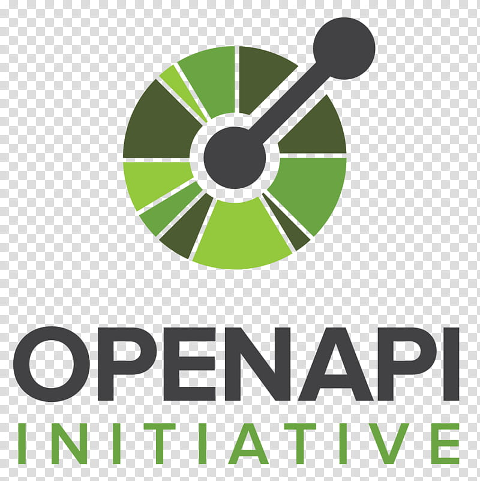
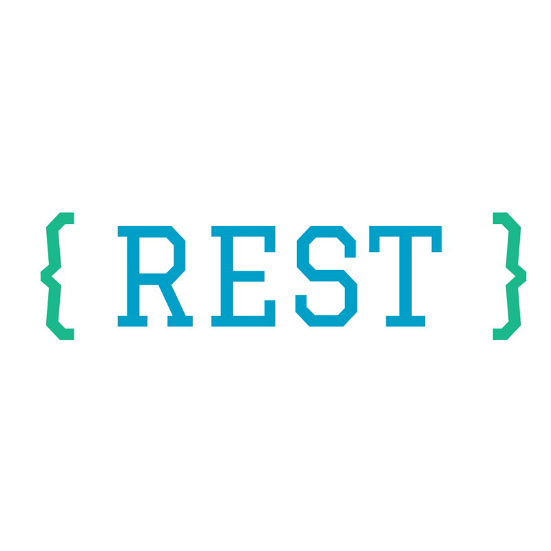
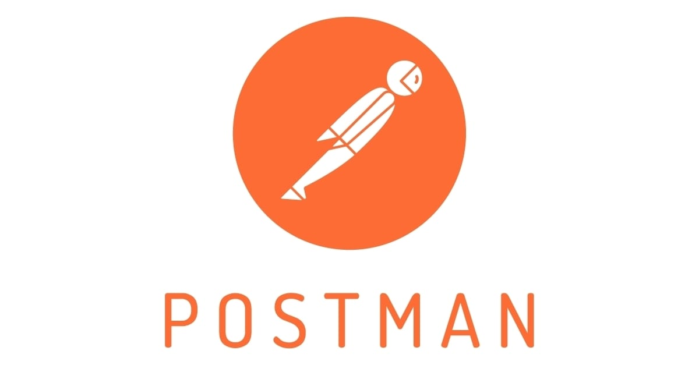
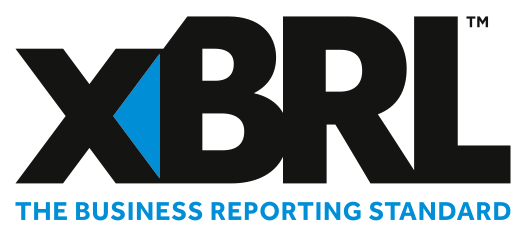
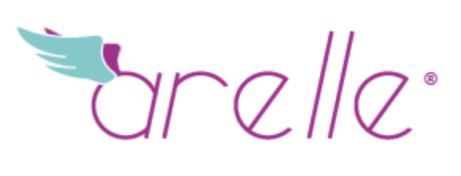
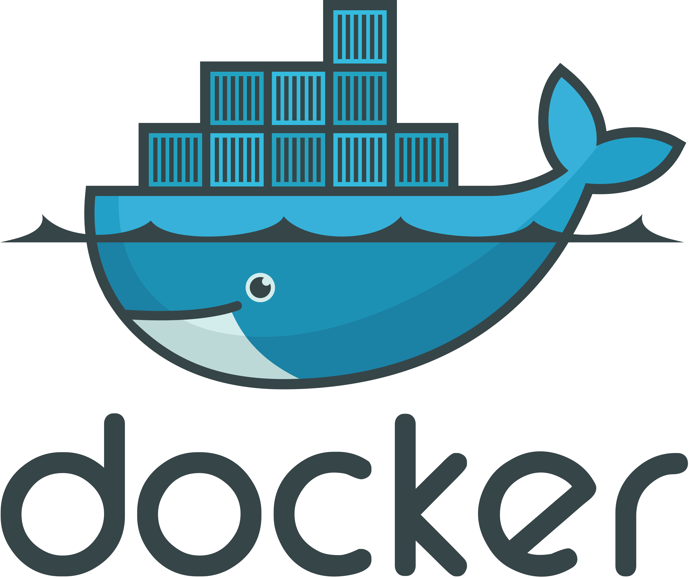
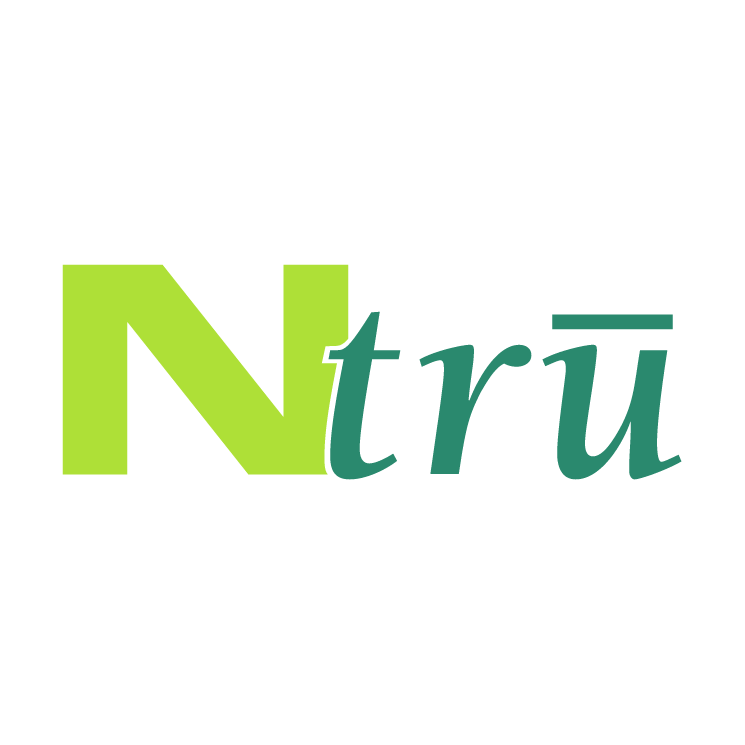
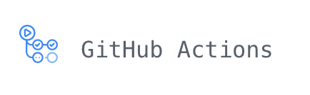
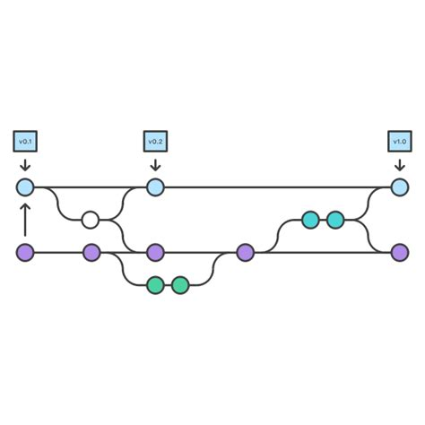
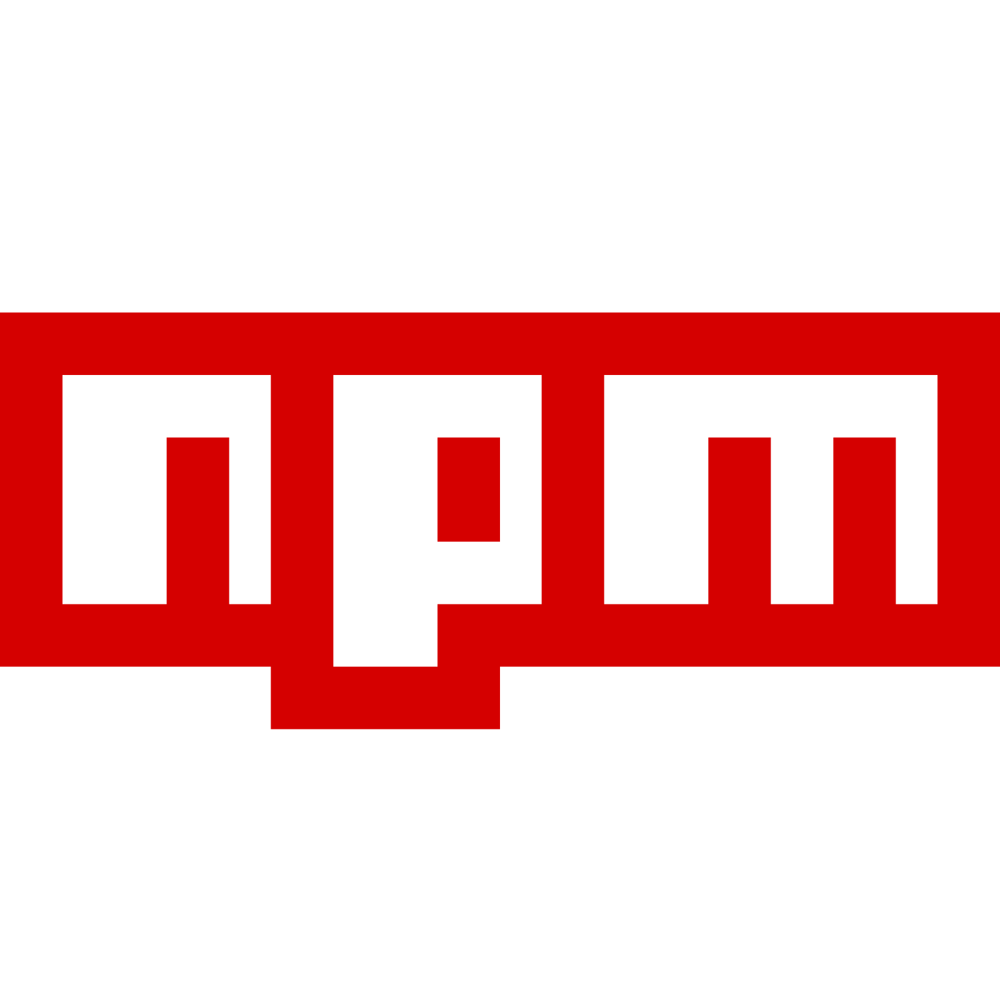

# KERI Development Environment and Techniques

**This document explains what development tools have been used and why.**

We're **not** addressing:
- Cypher Libraries used by the different KERI implementations. 
> Look for information here: [CypherSuites KeriPy](https://github.com/WebOfTrust/keripy/blob/development/ref/CypherSuites.md)
- Coding Style Guides in different KERI implementations.
> Look for information here: [Style Guide for KeriPy](https://github.com/WebOfTrust/keripy/blob/development/ref/PythonStyleGuide.md)

## KERI in general

There are a few commons reasons to choose development tools. Mostly because they have the following features:

- open source
- not patented
- best of breed
- universally applicable
- tested for a few years

We won't mention these fundamental feature for creating Autonomic Identifier systems in the rest of this document. Instead we'll focus on the specific reasons for choices compared to alternatives in the field. 

### What is Sphinx?

Sphinx is a documentation generator or a tool that translates a set of plain text source files into various output formats, automatically producing cross-references, indices, etc. That is, if you have a directory containing a bunch of reStructuredText or Markdown documents, Sphinx can generate a series of HTML files, a PDF file (via LaTeX), man pages and much more.\
Sphinx experience is a great asset for a GNU Linux technical writer.

[Source](https://www.sphinx-doc.org/en/master/)

#### Why is it relevant for KERI?
KERI's first implementation is in Python. Documenting the why of the code is human effort. Documenting *what the code does* is easily achieved with Sphinx, in multiple output formats.

#### Why Sphinx and not something else?
Best suited for documenting Python-code as you go as a developer.\
Sphinx uses reStructuredText as its markup language, and many of its strengths come from the power and straightforwardness of reStructuredText and its parsing and translating suite, the Docutils.

### What is Swagger and OpenAPI?

Formerly known as Swagger, OpenAPI has a long and established history. In 2010, Swagger started as an open source specification for designing and documenting RESTful APIs.
In 2015, the Swagger project was acquired by SmartBear Software. The Swagger Specification was donated to the Linux foundation and renamed the OpenAPI.

[Difference](https://swagger.io/blog/api-strategy/difference-between-swagger-and-openapi/)

#### Why is it relevant for KERI?
KERI is trustless and is a multi layered identity-system generator. A full-functioning KERI install uses many different nodes to talk to (Witnesses, watchers, wallets). RESTfull APIs are best suited for this task.

#### Why Swagger / OpenAPI and not something else?

OpenAPI (former Swagger, before version 2.0) is more important than the company Swagger to KERI, CESR and ACDC. It's open sourced and has many ready-usable extensions in JSON available.

### What exactly is a REST API?

There are numerous types of APIs, making it difficult for new developers to differentiate between each kind. In particular, REpresentational State Transfer (REST) is a software architectural style that developers apply to web APIs. REST APIs provide simple, uniform interfaces because they can be used to make data, content, algorithms, media, and other digital resources available through web URLs. Essentially, REST APIs are the most common APIs used across the web today

To make the API service RESTful, six guiding constraints must be satisfied:

1. Use of a uniform interface (UI): To have a uniform interface, multiple architectural constraints are required to guide the behavior of components. Additionally, resources should be unique so they are identifiable through a single URL.
2. Client-server based: The uniform interface separates user concerns from data storage concerns. The client’s domain concerns UI and request-gathering, while the server’s domain concerns focus on data access, workload management, and security. The separation of client and server enables each to be developed and enhanced independently of the other.
3. Stateless operations: Request from client to server must contain all of the information necessary so that the server can understand and process it accordingly. The server can’t hold any information about the client state.
4. RESTful resource caching: Data within a response to a request must be labeled as cache-able or non-cache-able.
5. Layered system: REST allows for an architecture composed of hierarchical layers. In doing so, each component cannot see beyond the immediate layer with which they are interacting.
6. Code on demand: Because REST APIs download and execute code in the form of applets or scripts, there’s more client functionality. Oftentimes, a server will send back a static representation of resources in the form of XML or JSON. Servers can also send executable codes to the client when necessary.

[Source](https://blog.postman.com/rest-api-examples/)

#### Why is it relevant for KERI?

KERI is multi layered and has duplicity detection as one of its main consensus mechanisms.

#### Why REST API and not something else?

Stateless REST APIs are vital for the implementation of the KERI design.

### What is a REST API wrapper?

A Wrapper Class (or the Wrapper Pattern) is where you declare a Class as a container for an sObject to extend the functionality only for display or processing purposes (i.e. you don't intend for that attribute to be persisted) - the classic example is a checkbox to select records. I would say that a DTO is a slightly dumbed down version of such a wrapper (used in conventional OOP to pass structured data between the layers)
A REST Api wrapper is something slightly different. For example Salesforce exposes a REST Api and if you were to invoke that say from C#, you would have to perform a set of common steps such as login, query, etc. To make this available in C# by abstracting the innards of the actual REST calls to salesforce and exposing only the developer relevant detail, you could write a rest wrapper which performs these commonly used functions - creates requests, parses responses, etc

[Source](https://salesforce.stackexchange.com/questions/5834/can-somebody-explain-what-is-a-rest-api-wrapper)

#### Why is it relevant for KERI?

KERI will be written in multiple programming languages. A wrapper is able to expose the result of API calls cross boundary (exceeding the developers direct intentions) or viewable / shareable a different programming language.

#### Why REST API wrapper and not something else?

It's simply the most obvious solution for the applications mentioned above.

### What is Postman? 

Postman is an API platform for building and using APIs. Postman simplifies each step of the API lifecycle and streamlines collaboration so you can create better APIs—faster.
[source](https://www.postman.com)

#### Why is it relevant for KERI?

It is a sophisticated EDI for KERI APIs.

#### Why Postman and not something else?

{TBW}

### What is Paw?

Paw is a full-featured HTTP client that lets you test and describe the APIs you build or consume. It has a beautiful native macOS interface to compose requests, inspect server responses, generate client code and export API definitions.

[Source](https://paw.cloud)

#### Why is it relevant for KERI?

{TBW}

#### Why Paw and not something else?

{TBW}
{Why not use containers for this?}

### What is XBRL?

XBRL is the open international standard for digital business reporting, managed by a global not for profit consortium, XBRL International. We are  committed to improving reporting in the public interest. XBRL is used around the world, in more than 50 countries. Millions of XBRL documents are created every year, replacing older, paper-based reports with more useful, more effective and more accurate digital versions.
In a nutshell, XBRL provides a language in which reporting terms can be authoritatively defined. Those terms can then be used to uniquely represent the contents of financial statements or other kinds of compliance, performance and business reports. XBRL lets reporting information move between organizations rapidly, accurately and digitally.

[Source](https://www.xbrl.org/the-standard/what/an-introduction-to-xbrl/)

#### Why is it relevant for KERI?

It's especially relevant for the GLEIF vLEI implementation of KERI and ACDC.

#### Why XBRL and not something else?

It is *the* open international standard for digital business reporting.

### What is Arelle?

Arelle is a project to provide the XBRL community with an easy to use open source platform for XBRL.  It supports XBRL and its extension features in an extensible manner.  It does this in a compact yet robust framework that can be used as a desktop application and can be integrated with other applications and languages utilizing its web service.

[Source](https://arelle.org/arelle/)

#### Why is it relevant for KERI?

{TBW}

#### Why Arelle and not something else?

{TBW}

### What is Workiva?

Workiva brings together everything you need—teammates, datasets, and data sources—so you can work better in the cloud. Wherever you are, whatever you’re doing. Automate what’s slowing you down. Focus on what fires you up.

[Source](https://www.workiva.com/en-nl/)

#### Why is it relevant for KERI?

{TBW}

#### Why Workiva and not something else?

{TBW}

## What is Docker?

Docker is an open source platform for building, deploying, and managing containerized applications. Learn about containers, how they compare to virtual machines (VM), and why Docker is so widely adopted and used.\
[Source](https://www.ibm.com/cloud/learn/docker)

#### Why is it relevant for KERI?

With Docker containerization the KERI development team is able to deliver a working stack for testing and demonstration purposes with a clear list of components and their versions in a confined environment.

#### Why Docker and not something else?

Docker is the most adopted and has various deployment options.

## What is NTRU?

NTRU is an open-source public-key crypto-system that uses lattice-based cryptography to encrypt and decrypt data. It consists of two algorithms: NTRUEncrypt, which is used for encryption, and NTRUSign, which is used for digital signatures. Unlike other popular public-key crypto-systems, it is resistant to attacks using Schnorr's algorithm. NTRUEncrypt was patented, but it was placed in the public domain in 2017. NTRUSign is patented, but it can be used by software under the GPL.

[Source](https://en.wikipedia.org/wiki/NTRU)

#### Why is it relevant for KERI?

It might be an alternative to our Libsodium libs. But...
            - Looks like NTRUSign is broken. 
            - NTRUEncrypt is usable. 
            - pqNTRUSign uses large signature sizes so is not immediately suitable for IOT
[More info](https://csrc.nist.gov/CSRC/media/Events/Second-PQC-Standardization-Conference/documents/accepted-papers/grobschadl-lighteight-implmentation-NTRUE.pdf)

#### Why NTRU and not something else?

It not as computational dense as alternatives. It is newer.

### What is CAXE?

It's Credential Attribute XBRL Extraction. An XBRL with ACDCs in it. 

[Source](https://github.com/WebOfTrust/caxe)

#### Why is it relevant for KERI?

XBRL is the open international standard for digital business reporting. To extend the field of application of ACDC and KERI in reporting, we'd like to offer this.

#### Why CAXE and not something else?

It's custom made for ACDC and KERI, there's nothing else.

### What is Github Actions?

GitHub Actions makes it easy to automate all your software workflows, now with world-class CI/CD. Build, test, and deploy your code right from GitHub. Make code reviews, branch management, and issue triage-ing work the way you want.\
[Source](https://github.com/features/actions)

#### Why is it relevant for KERI?

{TBW}

#### Why Github Actions and not something else?

Hosted runners for every major OS make it easy to build and test all your projects. Run directly on a VM or inside a container. Use your own VMs, in the cloud or on-prem, with self-hosted runners.

### What is Git Flow?

Git flow is a popular Git branching strategy aimed at simplifying release management, and was introduced by software developer Vincent Driessen in 2010. Fundamentally, Git flow involves isolating your work into different types of Git branches.

[Source](https://www.gitkraken.com/learn/git/git-flow)

#### Why is it relevant for KERI?

Multiple developers active and growing developers community needs simple but secure branching.

#### Why GIT Flow and not something else?

More secure than the easier versioning [Github Flow](https://www.gitkraken.com/learn/git/git-flow#github-flow) and [GitLab Flow](https://www.gitkraken.com/learn/git/git-flow#gitlab-flow)

### What is DidComm?

Powerful, high-trust, self-sovereign interactions over any transport

[Source](https://didcomm.org/)

#### Why is it relevant for KERI?

To build KERI Tunnels

#### Why DIDComm and not something else?

It's the intended layer two of DID technology supported by Decentralized Identity Foundation (DIF) and the Trust over IP foundation (ToIP).

## Java

### What is Cesr4j

IT's a JavaEE library for CESR encoding 

[Source](https://github.com/WebOfTrust/cesr4j)

#### Why is it relevant for KERI?

CESR is the main serialization tool for KERI. To extend the field of application of CESR we'd like to offer an JavaEE library.

#### Why Cesr4j and not something else?

It's custom made for CESR and KERI, there's nothing else.

### What is Bazel?

Bazel is an open-source build and test tool that scalably supports multi-language and multi-platform projects.

[Source](https://bazel.build/)

#### Why is it relevant for KERI?

One tool, multiple languages: Build and test using Java, C++, Go, Android, iOS and many other languages and platforms. Bazel runs on Windows, macOS, and Linux.

#### Why Bazel and not something else?

It replaces [Maven](https://maven.apache.org/).Rebuild only what is necessary. Fast, incremental builds with Bazel's advanced local and distributed caching, optimized dependency analysis, and parallel execution.

### What is WebAuth?

WebAuthn is a new standard for authentication, which is published by the World Wide Web Consortium and is supported by the FIDO alliance.

[Source](https://www.loginradius.com/blog/identity/webauth-secures-user-login/)

#### Why is it relevant for KERI?

{TBW}

#### Why WebAuth and not something else?

{TBW}

### What is IPEX?

Issuance and Exchange Protocol Specification for ACDC

[Source](https://github.com/WebOfTrust/ietf-ipex)

#### Why is it relevant for KERI?

Provides a uniform mechanism for the issuance and presentation of ACDCs in a securely attributable manner. 

#### Why IPEX and not something else?

It's a greatly simplified exchange protocol. The simplification has two primary advantages. The first is enhanced security. A well-delimited protocol can be designed and analyzed to minimize and mitigate attack mechanisms. The second is convenience. A standard simple protocol is easier to implement, support, update, understand, and adopt. The tooling is more consistent.

## Keripy

### What is Pypi?

The Python Package Index (PyPI) is a repository of software for the Python programming language.\
PyPI helps you find and install software developed and shared by the Python community. Learn about installing packages. Package authors use PyPI to distribute their software. Learn how to package your Python code for PyPI.\
[Source](https://pypi.org/)

#### Why is it relevant for KERI?

The team wants to distribute KERI uniformly and as broad as possible.

#### Why Pypi and not something else?

It's the best of breed and most commonly used in the Python community.

## KEEP

### What is NPM?

NPM is two things: first and foremost, it is an *online repository* for the publishing of open-source Node.js projects; second, it is a *command-line utility* for interacting with said repository that aids in package installation, version management, and dependency management.
[Source](https://nodejs.org/en/knowledge/getting-started/npm/what-is-npm/)

#### Why is it relevant for KERI?

For the Node.js implementation of KERI it comes in handy. Also KEEP has been build in Node.js.

#### Why NPM and not something else?

It's the number one solution for Node.js.

## KeriOX

### What is Dart?

 

Dart is a programming language designed for client development, such as for the web and mobile apps. It is developed by Google and can also be used to build server and desktop applications.
It is an object-oriented, class-based, garbage-collected language with C-style syntax.It can compile to either native code or JavaScript, and supports interfaces, mixins, abstract classes, reified generics and type inference.

[Source](https://en.wikipedia.org/wiki/Dart)

#### Why is it relevant for KERI?

{TBW}

#### Why Dart and not something else?

{TBW}

## KeriML

## What is KeriML?

KIMI Keri Interactive Mobile Interface, pronounced “Caramel”

#### Why is it relevant for KERI?

Keep repackage Electron app to invoke python backend IIW demos (April 2022) on UX/UI

#### Why KeriML and not something else?

{TBW}